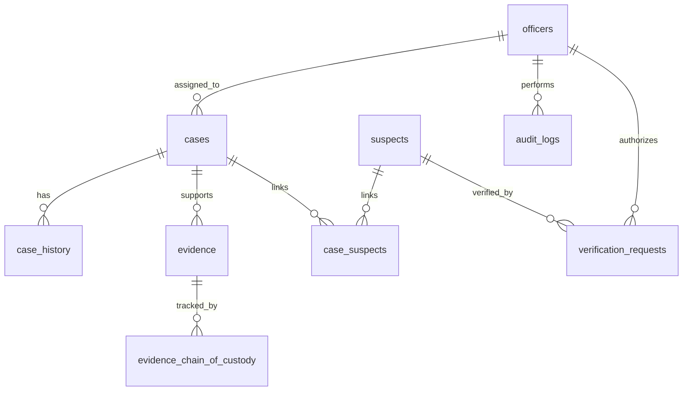

# Sentinel Crime Reporting and Case Tracking System

Sentinel is a production-oriented law-enforcement operations platform for case management, evidence handling, officer coordination, CCTV indexing, identity verification logging, offline-first sync, and analytics.

This repository now includes:

- A deployable Node.js host for Render and local development
- A browser-based React operations console
- MySQL schema, seed data, and migration scaffolding
- Security, synchronization, deployment, and integration documentation

## What Changed

The original repository was a static prototype with no root `package.json`, which caused Render to fail with:

```text
npm error enoent Could not read package.json: Error: ENOENT: no such file or directory, open '/opt/render/project/src/package.json'
```

The fix is now in place:

1. A root `package.json` has been added.
2. A root `server.js` has been added so the app can actually boot from the repository root.
3. The frontend now loads `sentinel/scripts/platform.jsx`, which expands the prototype into a module-based Sentinel console.
4. `scripts/dev.js` exits immediately in non-interactive build environments, so `npm run dev` will not hang a CI build.

For Render, the correct setup is still:

- Build command: `npm install`
- Start command: `npm start`

If you keep `npm run dev` as the build command, the included guard prevents a hang, but `npm start` should be used as the runtime command.

## Current Capabilities

- Case CRUD with automatic case numbers
- Status workflow: Open, Under Investigation, Evidence Collected, Awaiting Review, Closed
- Case history and audit logging
- Evidence intake with metadata and chain-of-custody tracking
- Officer profiles, role awareness, and workload tracking
- Offline-first browser queue and sync status indicators
- CCTV camera registry and footage lookup
- Identity verification logging with authorization checks and no raw biometric storage
- Suspect profiles with case linkage and verification status
- Analytics for trends, closure rates, and workload
- Security notes and audit visibility

## Folder Structure

```text
crime_report_system/
|-- README.md
|-- package.json
|-- server.js
|-- scripts/
|   `-- dev.js
|-- database/
|   |-- schema.sql
|   |-- seed.sql
|   `-- migrations/
|       `-- 001_initial_schema.sql
|-- docs/
|   (architecture and deployment docs can live here)
`-- sentinel/
    |-- sentinel-react.html
    |-- scripts/
    |   |-- app.jsx
    |   `-- platform.jsx
    `-- styles/
        `-- app.css
```

## Running Locally

### 1. Install dependencies

```bash
npm install
```

### 2. Start the app

```bash
npm start
```

Then open:

```text
http://localhost:3000/sentinel/sentinel-react.html
```

### 3. Optional development helper

You can also run:

```bash
npm run dev
```

That command is safe for local usage and CI-style build contexts.

## Render Deployment

Use a Render **Web Service**, not a static site, because Sentinel includes a Node.js server host.

Recommended settings:

- Runtime: Node
- Build command: `npm install`
- Start command: `npm start`
- Node version: 24.x is fine, but you can pin another supported version in Render if needed

If Render still points the build command at `npm run dev`, the repository will now exit cleanly instead of failing on missing `package.json`. Still, the proper runtime command is `npm start`.

## Architecture Overview

### Frontend

The frontend is a browser-rendered React console served from `sentinel/sentinel-react.html`.

It provides:

- Dashboard KPIs
- Case workspace
- Evidence vault
- Officer portal
- CCTV registry
- Identity verification workspace
- Suspect management
- Analytics dashboard
- Security and sync views

State is persisted in browser storage for offline-first behavior and demo-grade continuity.

### Backend

`server.js` serves:

- `/healthz` for health checks
- `/api` for service metadata
- `/sentinel/*` for the frontend
- `/docs/*` and `/database/*` for documentation and schema assets

The repository also includes the backend architecture scaffold needed to evolve this into a full API-backed platform.

## Database Design

The SQL assets model:

- `officers`
- `cases`
- `case_history`
- `evidence`
- `evidence_chain_of_custody`
- `suspects`
- `case_suspects`
- `cameras`
- `verification_requests`
- `audit_logs`

### ERD



## Security Architecture

Sentinel is designed around these principles:

- JWT authentication at the backend layer
- Role-based access control
- Least privilege by default
- Audit logging for all personal-data access
- Encryption for sensitive fields at rest
- No raw biometric template storage
- Authorized-agency-only identity verification
- User authorization required before identity verification attempts

The frontend includes permission-aware controls, but the API layer must enforce the same rules.

## Synchronization Architecture

Offline-first behavior works like this:

1. A user makes a change while the network is unavailable.
2. The browser stores the operation locally.
3. Sentinel shows a queued sync indicator.
4. When connectivity returns, queued operations can be replayed through the backend.
5. The system records the replay in audit logs.

This repository currently demonstrates the queue and local persistence behavior in the browser console.

## Identity Verification Integration

Sentinel supports a secure integration layer for:

- Fingerprint verification
- Facial recognition verification
- National ID verification

Integration rules:

- Use only authorized agency APIs
- Do not store raw biometric templates in Sentinel
- Log every verification request
- Require officer authorization before a request is issued

## Deployment Guide

### Render

1. Create a new Web Service.
2. Connect this repository.
3. Set the build command to `npm install`.
4. Set the start command to `npm start`.
5. Deploy.

### MySQL

Run the schema and seed files in this order:

1. `database/schema.sql`
2. `database/seed.sql`

If you use a migration runner, start with `database/migrations/001_initial_schema.sql`.

## Notes and Limits

- The React console currently uses browser storage for local-first persistence.
- Large media files should be stored in object storage or a backend upload service in a full production rollout.
- The SQL schema is production-oriented, but the repository still needs a real database connector and API layer for full backend persistence.

## Next Steps

1. Wire the React console to the Express API and MySQL schema.
2. Add upload endpoints for evidence and CCTV footage.
3. Replace browser-only auth with JWT-backed sessions.
4. Add real object storage for evidence binaries.
5. Add automated tests for case and audit workflows.
